<!DOCTYPE HTML PUBLIC "-//W3C//DTD HTML 4.0 Transitional//EN">
<HTML>
<HEAD>
	<META HTTP-EQUIV="CONTENT-TYPE" CONTENT="text/html; charset=utf-8">
 	<META NAME="GENERATOR" CONTENT="LibreOffice 4.1.6.2 (Linux)">
	<META NAME="AUTHOR" CONTENT="Moustafa Ismail">
	<META NAME="CREATED" CONTENT="20190925;220200000000000">
	<META NAME="CHANGEDBY" CONTENT="thrwat zidan-thrwatz213@gmail.com-01200504634">
	<META NAME="CHANGED" CONTENT="20190925;220200000000000">
	<META NAME="AppVersion" CONTENT="12.0000">
	<META NAME="DocSecurity" CONTENT="0">
	<META NAME="HyperlinksChanged" CONTENT="false">
	<META NAME="LinksUpToDate" CONTENT="false">
	<META NAME="ScaleCrop" CONTENT="false">
	<META NAME="ShareDoc" CONTENT="false">
	
</HEAD>
<BODY LANG="en-US" DIR="LTR">

Name of
your project

Android
restaurant E commerce &amp; mangment system &amp; bouns delivery app

 
Thrwat
zidan ghazy

The
Technology Of your Project

Java
Android,mysql database,nodejs,firebase intgration,google map
integration,room database

 

  

  

  

  

  

<B>Overview</B>

 

Write
Here an overview 

  

My
restaurant that’s The name of our android system to make our
customers updated with our new menu and food items and so confortable
to make them orders from home or work place, the first idea to track
them order   on map , validity to pay the order by credit or cash  

 

<B>نظرة
عامة</B>

 

مطعمى
هو اسم النظام الذى اطلقناه على نظام
الاندرويد الخاص بادارة المطاعم لتسهيل
على عملاءنا للوصول الى قواءم الطعام 
الجديدة وانواع الاطعمه الفريدة التى
يقدمها مطعمك ،وللوصول لكل سبل الىاحة
لدى العملاء امكانية طلب  الوجبة الخاصة
بك ومتابعتها على الخريطة ،بالاضافة
لامكانية الدفع المسبق ببطاقة الاءتمان
او الدفع نقدا 	  

  

<B>How
to active my project</B>

<UL>
	<LI>

	Just android mobile with min sdk  version 19 to the
	last sdk 
	

	<LI>
Phone
	number 
	

</UL>

<B>كيفية
تفعيل مشروعي</B>

<UL>
	<LI>
فقط
	هاتف يعمل بنظام الاندرويد لتشغيل الثلاث
	تطبيقات ابتداء من اصدار ١٩ الى اخر اصدار
	يعمل به الهاتف

	<LI>
رقم
	تلفون لستقبال رساءل التاكيد

</UL>

  

  

<B>features
</B>

  

<UL>
	<LI>
Phone number
	verification

	<LI>
View menu
	items with image

	<LI>
View food
	items with image and price

	<LI>
Add food
	item to favorites’ to fast request 
	

	<LI>
View food
	item details with more  send screen shot feature by any messaging
	app

	<LI>
Delete from
	cart any item or update price or restore it again

	<LI>
Sending
	order by location

	<LI>
Adding any
	comment or address detail at ordering 
	

	<LI>
View all
	social media pages and send mails or direct call with the restaurant

	<LI>
Pay order
	price with credit or cash after delivery 
	

	<LI>
Tracking
	order on map with polyline  tracking 
	

	<LI>
In mangment
	app can add or delete or update any menu

	<LI>
Delete or
	update or add food items

	<LI>
Tracking
	order and delivery employers 
	

	<LI>
Accept or
	cancel cash orders

	<LI>
Review all
	food comment and rates 
	

	<LI>
See your
	restaurant  financial accounting  with graphs

	<LI>
Sending
	notification with the new  food  details, or new food offers

	<LI>
Follow up
	your daily financial 
	

</UL>

  

<B>الميزات</B>

<UL>
	<LI>
التحقق
	من رقم الهاتف

	<LI>
عرض
	عناصر القائمة مع الصورة

	<LI>
عرض
	الاكلات مع الصورة والسعر

	<LI>
إضافة
	اكله إلى المفضلة &quot;لطلب
	سريع

	<LI>
عرض
	تفاصيل الاكلات مع  ميزة إرسال لقطة
	الشاشة من قبل أي تطبيق المراسلة   
	

	<LI>
قم
	بحذف أي طلب أو تعديل الكمية من السلة
	المشتروات أو استعادته مرة أخرى

	<LI>
إرسال
	الطلب حسب الموقع

	<LI>
إضافة
	أي تعليق أو تفاصيل العنوان في الطلب

	<LI>
دفع
	سعر الطلب من بطاقة الائتمان أو نقدا بعد
	التسليم

	<LI>
تتبع
	طلبك على الخريطة مع تتبع polyline

	<LI>
في
	التطبيق الادارة يمكن إضافة أو حذف أو
	تحديث أي قائمة

	<LI>
حذف
	أو تحديث أو إضافة اكلات

	<LI>
تتبع
	الطلبات وموظفين التوصيل

	<LI>
قبول
	أو إلغاء أوامر النقدية

	<LI>
مراجعة
	جميع التعليقات الخاصة بالاكلات  وتقيماتها

	<LI>
مراجعه
	المحاسبة المالية لمطعمك مع الرسوم
	البيانية

	<LI>
إرسال
	إشعار مع تفاصيل المواد الغذائية الجديدة
	، أو العروض الغذائية الجديدة 
	متابعة المالية
	اليومية.

	<LI>
عرض
	صفحات التواصل الاجتماعى وارسال اميلات
	واتصال مباشر من خلال البرنامج بالمطعم

</UL>

  

  

  

   

  

<B>User
Interface (UI)</B>

 
 

Description
of it

Starting screen
with room database

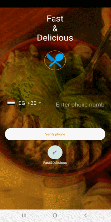<B>Login</B>
<B>Page</B>

 
 
 

Description
of it

Start login or
register by enter your phone number

 

Description
of it

To make
successful register Enter all data

 

<B>Login
Password Screen</B>

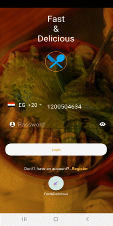  

  

  

  

  

  

Description
of it

Making final
login by enter your password

<B>Home
Page</B> (Menu
Page)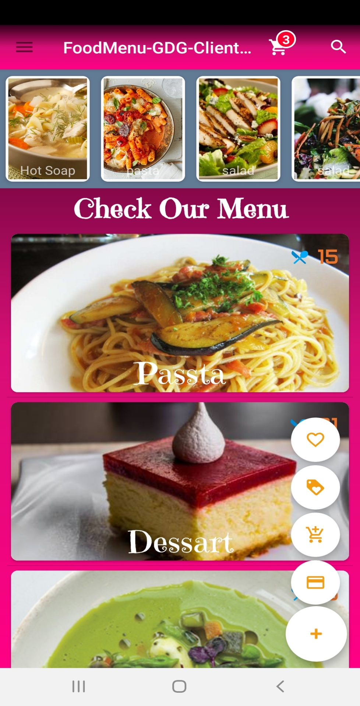

  

 

Description
of it

View all menu’s
and fast button to transport around the app from cart and search and
other’s

 

<B>Slide
Menu</B> (Menu
Page)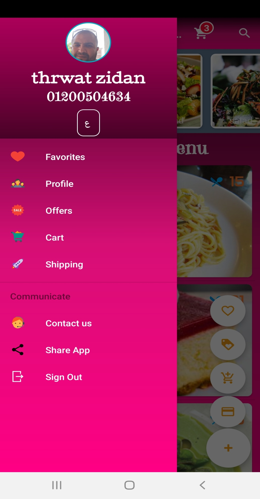

  

 
 

Description
of it

Slide menu view
your data and change app language ,can share the app with any
massager app 

And a lot option
.

<B>Favorites</B><B>
Page</B>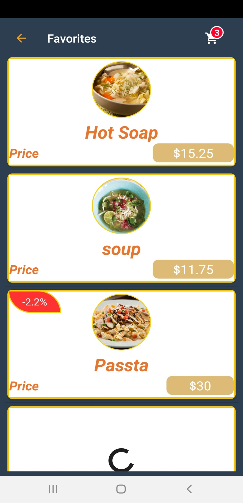

  

  

 

Description
of it

View  your
choice favorite  

<B>Offer</B><B>
Page</B>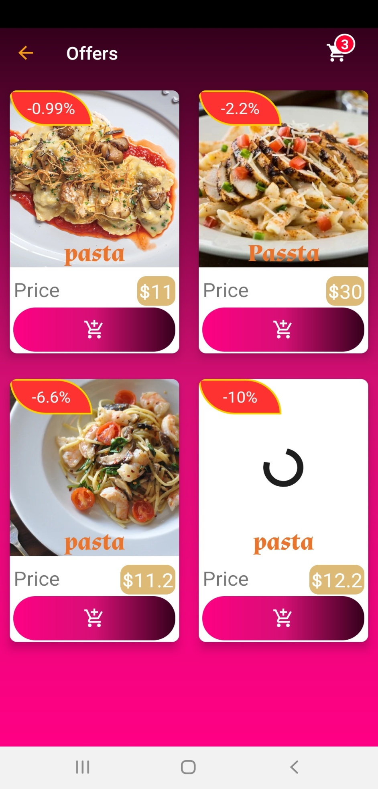

  

 

Description
of it

View  all food
offer with price and offer percent  and direct add to cart

<B>Cart</B><B>
Page</B>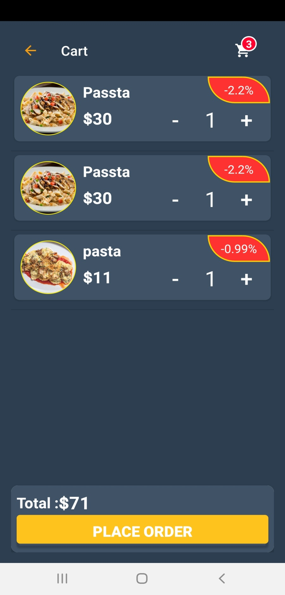

  

  

  

 

Description
of it

Cart page view
your sclected item from food and can delete it or check out  with
place order

<B>Checkout
</B><B> Page </B><B>(placeOrder)</B>

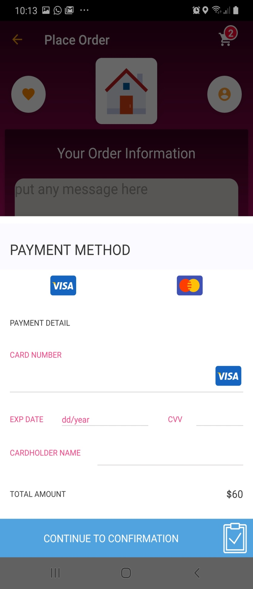  

  

 

Description
of it

Visa input
dialog to enter your visa details

<B>Checkout
</B><B> Page
</B><B>(placeOrder-2)</B>

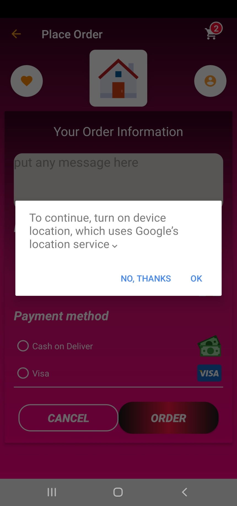  

 

Description
of it

Select location
with lat &amp; lng    

<B>Checkout
</B><B> Page
</B><B>(placeOrder-3)</B>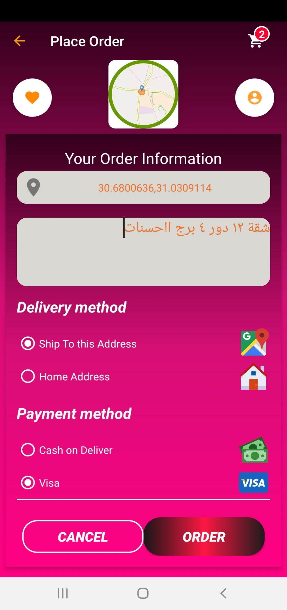

  

 

Description
of it

Enter any
address detail or comment

<B>Successful
Odering </B><B> Page
</B><B>(placeOrder)</B>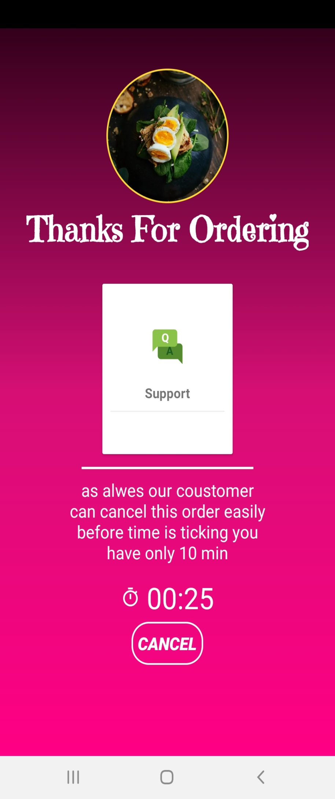

  

 

Description
of it

This page mean
you successfully making check out  and you can cancel this order 
until the counter get down

<B>sending
mail </B><B> Page
</B><B>(Support page#1)</B>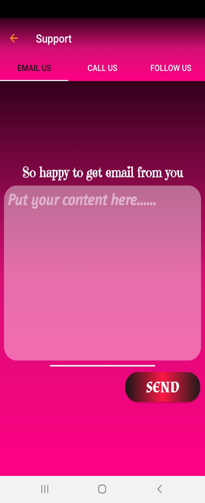

  
 

Description
of it

Direct sending
email to the restaurant 

<B>Call
</B><B> Page </B><B>(Support
page #2)</B>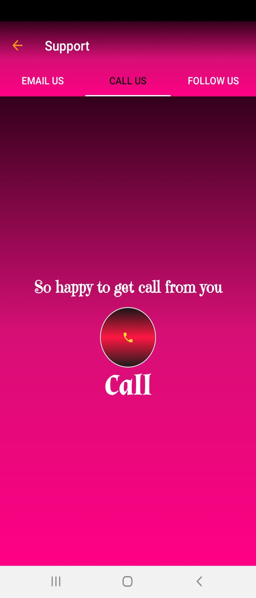

  

 

Description
of it

Direct  Making 
to the restaurant 

<B>SocialMedia
</B><B> Page </B><B>(Support
page #3)</B>

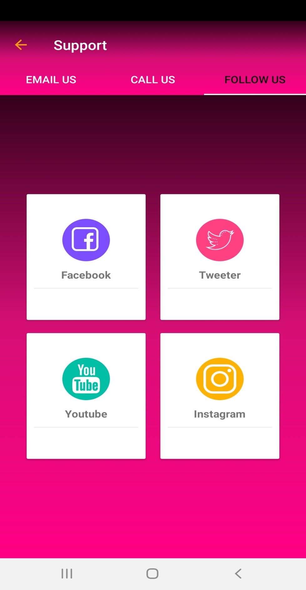  

 

Description
of it

Direct  view All
social media pages for our restaurant 

<B>Profile
</B><B> Page </B>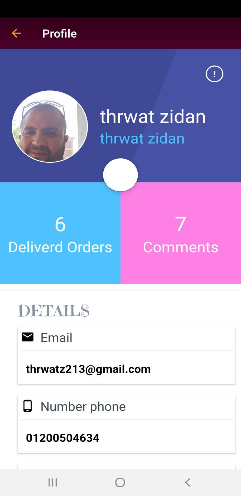

 

  

  

Description
of it

View  and update
all your personal data

<B>Food
Item </B><B> Page </B><B>(add
to cart)</B>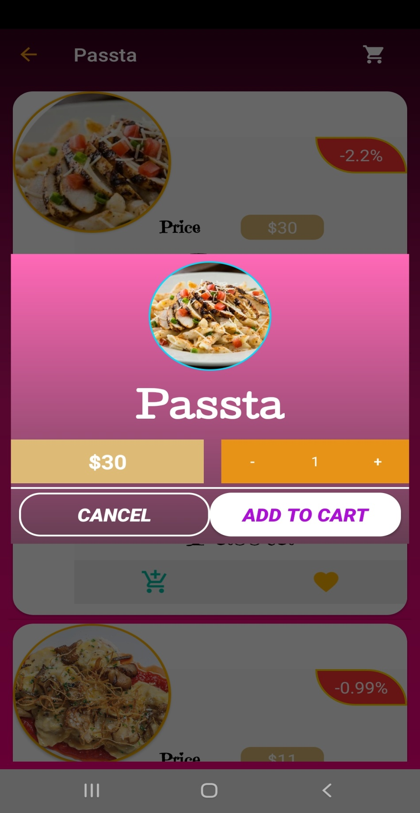

 

Description
of it

View all single
menu item and you can add any item to your cart 

<B>Profile
</B><B> Page </B><B>(favorite
Dialog )</B>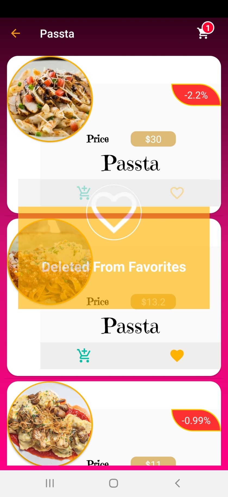

 

Description
of it

View all single
menu item and you can add any item to your favorites delete it just
click the heart button  

<B>FoodDetails
</B><B> Page </B>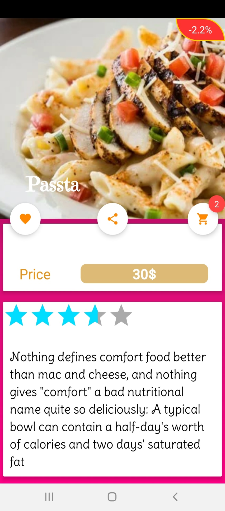

 
 

Description
of it

View all single
menu item and you can add any item to your favorites delete it just
click the heart button  

<B>Comments
and Rate </B><B> </B><B>(Food
Details Page)</B><B> </B>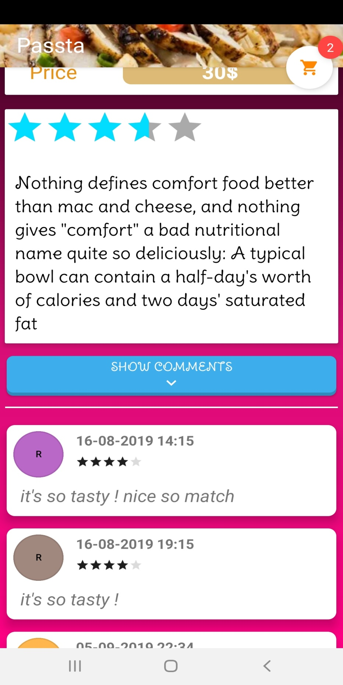

  

 

Description
of it

View all single
food item comments by date with how many stare rate

<B>Food
Details </B><B> </B><B>(Comment,
Rate Dialog)</B><B> </B>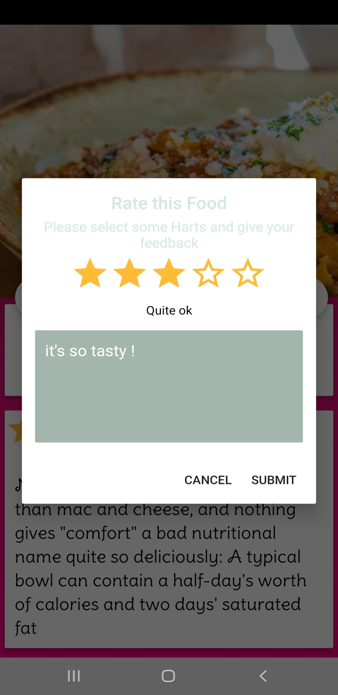

  

 

Description
of it

Put your own
comment and rate for your food

<B>Empty
Cart </B><B> </B><B>(Cart
Page)</B><B> </B>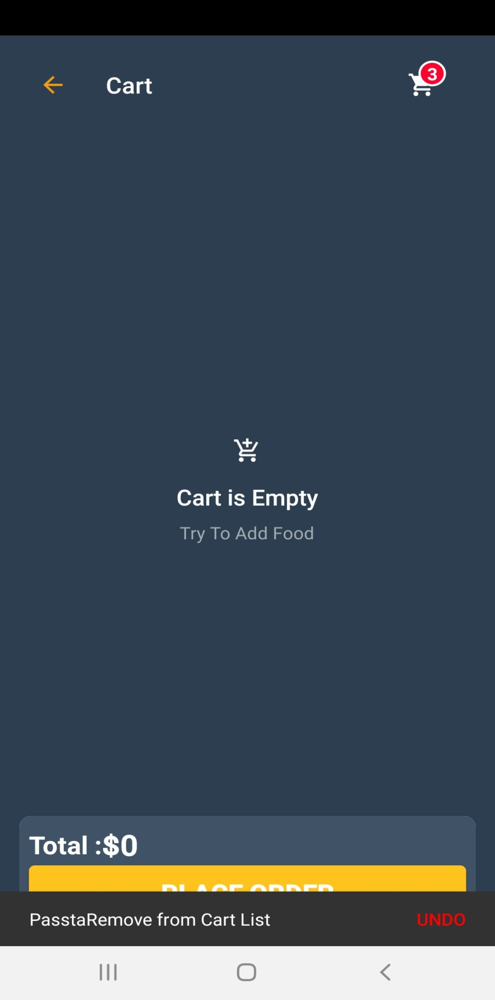

  

  

 

Description
of it

Empty cart view 
with undo delete item (restore it again)

<B>check
connection </B><B> </B><B>(all
pages)</B><B> </B>

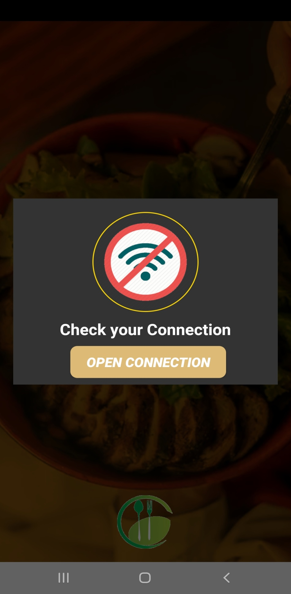  

  

 

Description
of it

Check connection
dialog with open wifi connection button

 
</BODY>
</HTML>
